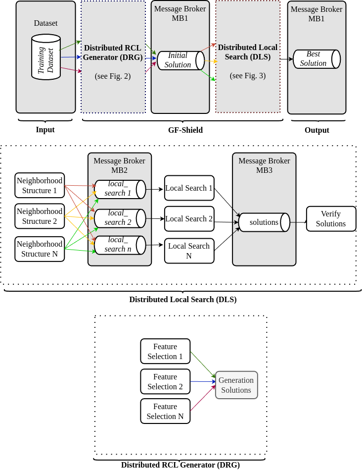

# GF-Shield: Selecao de Features Distribuida para IDS

## 📃 Visão Geral

**GF-Shield** é uma arquitetura distribuída baseada na metaheurística **GRASP-FS**, voltada para a seleção de atributos em sistemas de detecção de intrusões (IDS). O sistema é dividido em duas partes principais:

* **DRG (Distributed RCL Generator)** — Gera as listas candidatas (RCL) com diferentes algoritmos de seleção de features.
* **DLS (Distributed Local Search)** — Aplica técnicas de busca local distribuídas sobre essas listas para encontrar a melhor solução.

---

## 🧠 Algoritmos Utilizados (DRG)

Cada algoritmo roda como um microsserviço independente e envia soluções para o Kafka:

* Information Gain (porta **8089**)
* Gain Ratio (porta **8088**)
* Symmetrical Uncertainty (porta **8087**)
* Relief (porta **8086**)

---

## 🔍 Parâmetros de Entrada

Todos os algoritmos DRG recebem os seguintes parâmetros via `x-www-form-urlencoded`:

* **maxGenerations**: número de soluções a serem geradas por execução.
* **rclCutoff**: número máximo de features que compõem a lista RCL.
* **sampleSize**: quantidade de features sorteadas da RCL para cada solução.
* **datasetTrainingName**: nome do arquivo `.arff` de treinamento (deve estar na pasta `/datasets`).
* **datasetTestingName**: nome do arquivo `.arff` de teste.
* **classifierName** *(opcional)*: classificador Weka a ser usado (`J48`, `NB`, `RF`...).

---

## 🔁 Microsserviços de Busca Local (DLS)

Aplicam a busca sobre as soluções vindas dos DRG:

* BitFlip (**8082**)
* IWSS (**8083**)
* IWSSR (**8084**)
* Verify (**8085**)
* RVND (**8090**)
* VND (**8091**)

---

## 🚀 Arquitetura Geral



### DRG: Gera listas RCL iniciais a partir dos datasets.

### DLS: Recebe as listas e aplica busca local com VND ou RVND e algoritmos BitFlip, IWSS ou IWSSR.

#### Fluxo:

```
[datasets/] ➔ [Microsserviços DRG] ➔ [Kafka - Initial Solutions Topic]
                                      ➔ [Microsserviços DLS]
                                      ➔ [Kafka - Best Solutions Topic]
                                      ➔ [IDS]
```

---

## 🚚 Tecnologias

* Java 17
* Spring Boot 2.7.x
* Apache Kafka
* Weka
* Docker & Docker Compose
* Conduktor Console

---

## 📦 Execução com Docker Compose

### 1. Estrutura esperada

```
project-root/
├── datasets/          # Dataset compartilhado (entrada)
├── metrics/           # Arquivos .csv salvos (saída)
├── docker-compose.yml
```

### 2. Rodar o projeto

```bash
docker-compose up --build
```

### 3. Acesso ao Kafka

Acesse [http://localhost:8080](http://localhost:8080) para visualizar os tópicos no Conduktor.

---

## 📃 Resultados

Todos os resultados (F1, features, tempo, etc.) são salvos automaticamente nos arquivos `.csv` dentro do volume `/metrics`.

---

# GF-Shield: Scalable Feature Selection for Intrusion Detection

## 📃 Overview

**GF-Shield** is a distributed system based on the **GRASP-FS** metaheuristic for selecting features in IDS. It is divided into:

* **DRG (Distributed RCL Generator)** — Generates candidate lists (RCL) with classic feature selection algorithms.
* **DLS (Distributed Local Search)** — Applies distributed local search using VND or RVND.

---

## 🧠 Algorithms Used (DRG)

Each algorithm runs as a microservice and sends initial solutions to Kafka:

* Information Gain (**8089**)
* Gain Ratio (**8088**)
* Symmetrical Uncertainty (**8087**)
* Relief (**8086**)

---

## 🔍 Input Parameters

All DRG algorithms accept the following parameters via `x-www-form-urlencoded`:

* **maxGenerations**: number of candidate solutions to generate.
* **rclCutoff**: max number of features to compose RCL.
* **sampleSize**: number of features drawn from RCL per solution.
* **datasetTrainingName**: name of `.arff` training file (must be in `/datasets`).
* **datasetTestingName**: name of `.arff` test file.
* **classifierName** *(optional)*: Weka classifier (`J48`, `NB`, `RF`...).

---

## 🔁 Local Search Microservices (DLS)

Perform distributed optimization over candidate solutions:

* BitFlip (**8082**)
* IWSS (**8083**)
* IWSSR (**8084**)
* Verify (**8085**)
* RVND (**8090**)
* VND (**8091**)

---

## 🚀 Architecture


### DRG: Generates RCL lists from training data.

### DLS: Receives initial lists and performs search (BitFlip, IWSS, IWSSR).

#### Flow:

```
[datasets/] ➔ [DRG Microservices] ➔ [Kafka - Initial Solutions Topic]
                                  ➔ [DLS Microservices]
                                  ➔ [Kafka - Best Solutions Topic]
                                  ➔ [IDS]
```

---

## 🚚 Technologies

* Java 17
* Spring Boot 2.7.x
* Apache Kafka
* Weka
* Docker & Docker Compose
* Conduktor Console

---

## 📦 Running with Docker Compose

### 1. Expected structure

```
project-root/
├── datasets/          # Shared input
├── metrics/           # CSV output
├── docker-compose.yml
```

### 2. Start

```bash
docker-compose up --build
```

### 3. Access Kafka UI

Visit [http://localhost:8080](http://localhost:8080) for Conduktor Console.

---

## 📃 Output

All results (F1-score, features, etc.) are saved automatically in `.csv` files under the `/metrics` volume.

